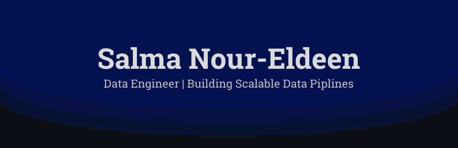

---

### About Me

I'm a Computer Science and Artificial Intelligence student, specializing in **Data Engineering**.  
My work spans across data pipelines, distributed processing, and data architecture, with hands-on experience in both batch and streaming environments. I’m particularly interested in how data flows, scales, and supports real-world decision-making through modern cloud platforms.

---

# Tech Stack & Skills Overview

### Programming

---

### Data Engineering & Big Data

---

### Databases & Data Modeling

---

### Data Pipeline & ETL/ELT

---

### Cloud & DevOps

---

### Monitoring & Logging / BI

---

### GitHub Activity

  
  

 

---

### Connect With Me

  
  
  

---

*Turning data into insight, one pipeline at a time.*
