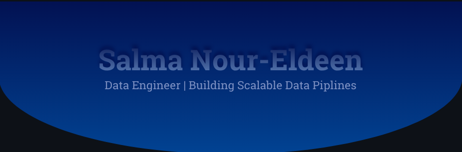

# Salma Nour-Eldeen

**Data Engineer | Building Scalable Data Pipelines**

---

### About Me

I'm a Computer Science and Artificial Intelligence student, specializing in **Data Engineering**.

My work spans across data pipelines, distributed processing, and data architecture, with hands-on experience in both batch and streaming environments. I’m particularly interested in how data flows, scales, and supports real-world decision-making through modern cloud platforms.
---

### Tech Stack

#### 💻 Programming

---

#### ⚙️ Data Engineering

---

#### 🧊 Data Lake & Storage

---

#### ☁️ Cloud & DevOps

---

#### 🗄️ Databases

---

#### 🔄 Orchestration & ETL

---

#### 📊 Monitoring & BI

---
 

### GitHub Activity

  
  

---

### Connect With Me

I'm always open to discussing data engineering opportunities, collaborations, or interesting ideas.

  
  
  

---

*Turning data into insight, one pipeline at a time.*
